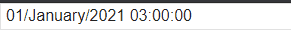

# Cone Center Test Case
Тестовое задание для ConeCenter.

### Задача

Требуется реализовать инпут, для ввода даты со следующим функционалом:

1. Формат валидной строки - 01/January/2021 00:00:00.
Опционально - предусмотреть парсинг введенного текста согласно дэмке.
2. По нажатию на клавиатуре стрелок вверх (↑) и вниз (↓) в зависимости от положения курсора увеличивается или уменьшается на 1 часть даты по циклу и выделяется изменяемая часть инпута. Например, если поставить курсор на месяц и нажать вверх то дата переключится на следующий месяц, при увеличении декабря дата переключается на январь, год при этом не изменяется.
3. По нажатию на клавиатуре комбинаций ctrl + ↑ или ctrl + ↓ происходит то же самое, но не по циклу. Например, при увеличении дня в декабре номер дня увеличивается по одному до 31 числа, после чего 31/December/2021 12:13:00 + 1 день -> 01/January/2022 12:13:00.
4. В инпут также можно вводить текст.
В качестве решения принимается функциональная компонента(ы), написанная с использованием React. Приветствуется реализация на TypeScript.

